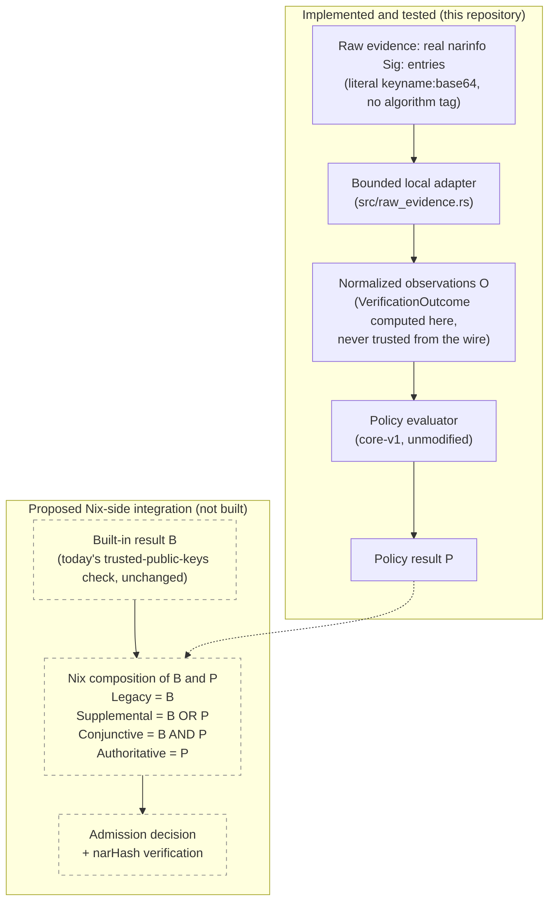
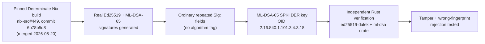

# Raw-evidence adapter

`src/raw_evidence.rs` (plus `src/raw_protocol.rs` and the
`nix-signature-authorize-raw` binary) is a provisional bridge that lets the
reference implementation independently verify real Nix `Sig:` entries on
*current* Nix, without depending on `NixOS/nix#15926` (or equivalent
native multi-algorithm verification) landing first.

## Why this exists

`core-v1`'s `SignatureCandidate` (`src/policy.rs`) requires `verification:
VerificationOutcome` as **caller-supplied** input. By design, `core-v1` is
representation-neutral and never touches raw cryptographic bytes --
`policy_adapters.rs`'s own header comment says so explicitly: *"adapters
consume fixture observations, not untrusted production bytes... production
wire parsers remain responsible for... cryptographic verification."* That
makes `core-v1` / `nix-signature-authorize` a **verified-observation
consumer**, not a **raw-evidence processor** -- something upstream of it
must already have checked each signature before it reaches the evaluator.

Today's Nix cannot supply verified ML-DSA observations itself. This module
is that upstream verifier for *current* Nix: it takes exactly what a real
`.narinfo` already carries and verifies each entry itself, using this
crate's own vendored, algorithm-specific primitives
(`hybrid::verify_ed25519_only`, `hybrid::verify_ml_dsa_only`), then
constructs `SignatureCandidate`s. `core-v1` itself is never modified.

```
Raw evidence (fingerprint + literal "keyname:base64" Sig: entries
              + a trusted verification-key registry)
        |  src/raw_evidence.rs  (provisional, NOT core-v1)
        v
Verified SignatureCandidate observations  (VerificationOutcome computed
        |                                   HERE, never trusted from input)
        v
Existing frozen core-v1 evaluator (unchanged)
```

This design, and every claim below, was validated against a real,
independently-built Nix -- not just self-generated fixtures. See
`tests/fixtures/determinate-nix-449/PROVENANCE.md` for the full build
record.

## No algorithm tag on the wire, by design

A real narinfo `Sig:` entry is `"keyname:base64"` and nothing else --
confirmed directly against `DeterminateSystems/nix-src#449`
(commit `6b78b5d8b4332f8f302abd19d1b9d9e7edbb8ce6`): exporting a signed
store path to a local binary cache and reading the resulting `.narinfo`
byte-for-byte shows two ordinary `Sig:` lines (one Ed25519, one ML-DSA-65),
neither carrying any algorithm marker. There is no per-entry algorithm
field to parse, and a raw entry cannot self-declare one.

Consequently `RawSignatureEntry` is just `type RawSignatureEntry =
String` -- a literal `"keyname:base64"` entry, parsed with
`narinfo::parse_sig_entry`, exactly like a real `Sig:` line. **The
`VerificationKeyEntry` registry -- trusted local configuration, never wire
input -- is the sole source of truth for which algorithm a claimed key
name means.** A signature entry can claim any key name; it cannot assign
itself an algorithm or public key.

An earlier draft of this adapter (see this document's git history) put an
`algorithm` field directly on `RawSignatureEntry`. That was wrong: it
implied algorithm selection could come from the wire claim, when in fact
only trusted local state can make that determination safely.

## Unique key names, not `(key_name, algorithm)` lookup

`verify_raw_evidence` requires **unique key names** in
`verification_keys`; a duplicate name is rejected outright as invalid
configuration (`RawEvidenceError::DuplicateVerificationKeyName`), before
any signature is even looked at.

This isn't just a simplifying choice -- it mirrors a real, reproducible
limitation of current Nix itself. Signing one store path with an Ed25519
key and an ML-DSA-65 key that share the *identical* `--key-name` produces
a narinfo with two valid `Sig:` entries under that one name, but `nix
store verify --trusted-public-keys "<ed25519> <ml-dsa>" --sigs-needed 2`
**fails** ("path ... is untrusted", exit 2) -- deterministically, and
independent of the order the two `--trusted-public-keys` are given. At
`--sigs-needed 1`, either key alone (or both together) succeeds, meaning
only one of the two same-named keys is ever actually live in Nix's
internal trust map at a time; the other is silently shadowed. Full
reproduction in `tests/fixtures/determinate-nix-449/PROVENANCE.md`'s
"Same-name collision" section, and covered by
`tests/raw_evidence_interop.rs`'s
`same_name_collision_registry_is_rejected_as_duplicate_config` and
`same_name_collision_with_only_ed25519_key_registered_ml_dsa_entry_fails_safe`.

**Even current Nix's own newest multi-algorithm signing implementation
cannot make one operator identity simultaneously trusted under both
algorithms through the built-in key-name mechanism alone.** The correct
pattern -- confirmed working at `--sigs-needed 2` -- is distinct key names
per algorithm (e.g. `acme-release-ed25519-1` / `acme-release-mldsa65-1`),
with the "same publisher" relationship expressed one layer up, in trusted
local policy metadata (identity/authority/role), not in the wire key-name
string itself. This adapter's registry enforces exactly that shape.

A more flexible rule -- allow several verification keys under one name,
try each compatible verifier, accept if exactly one interpretation
succeeds -- was considered and deliberately not built. It introduces
ambiguity (a byte sequence tested under multiple algorithms) for no
real-world benefit once distinct key names are already required in
practice; unique names are simpler, auditable, and match what the
Determinate build already demonstrated working.

## Public key encodings

`VerificationKeyEntry::encoding` is one of:

- `raw` -- fixed-length raw key bytes: this crate's own generated format
  (`hybrid::HybridSigner`), and Ed25519's real on-wire form (checked, not
  assumed -- a real Determinate-generated Ed25519 public key decodes to
  exactly 32 raw bytes, no wrapper).
- `spki-der` -- X.509 SubjectPublicKeyInfo DER, the real encoding observed
  from `nix key convert-secret-to-public --key-type ml-dsa-65`
  (Determinate Nix, OpenSSL-backed): 1974 bytes, not the raw FIPS-204 1952
  -- a `SEQUENCE { SEQUENCE { OID ML-DSA-65 }, BIT STRING <1952 raw bytes>
  }` wrapper (confirmed with `openssl asn1parse`). Signatures have **no**
  such wrapper -- `ml-dsa-65` `Sig:` entries are exactly 3309 raw FIPS-204
  bytes.

`spki-der` is parsed with real ASN.1/SPKI decoding
(`ml_dsa::pkcs8::SubjectPublicKeyInfoRef` +
`ml_dsa::VerifyingKey::<MlDsa65>::try_from(..)`), not a hand-rolled
fixed-offset byte slice. This validates the ASN.1 structure, asserts the
algorithm OID is exactly ML-DSA-65, and rejects trailing or malformed
data -- all via the same `pkcs8`/`der`/`spki` crates `ml-dsa` itself
already depends on (zero new dependencies). Covered by
`spki_der_with_trailing_bytes_is_rejected` and
`spki_der_with_wrong_algorithm_oid_is_rejected` in `src/raw_evidence.rs`.

## `Sig-PQC:` correction

An earlier prototype in this crate speculatively invented a `Sig-PQC:`
narinfo field for a second (PQC) signature. Real Nix does not do this --
it emits ordinary repeated `Sig:` lines, one per key, regardless of
algorithm. `Sig-PQC:` should be treated as this project's own
historical/prototype-specific field, not a claim about real narinfo wire
format. `NarInfo.sigs: Vec<String>` already handles multiple `Sig:` lines
correctly, so nothing about this adapter depends on `Sig-PQC:` existing.
(Marking `Sig-PQC:` itself as deprecated in the narinfo module is tracked
as a separate, out-of-scope-for-this-series cleanup.)

## What this does and does not remove as a dependency

The cryptographic adapter removes the dependency on Nix itself producing a
`VerificationOutcome` -- that part is fully real and independently
verified against `nix-src#449`. It does **not**, by itself, add the actual
invocation hook: Nix must still be modified (or some other local
integration must exist) to hand a helper the canonical fingerprint, raw
signatures, and enough context to call this adapter at the real admission
boundary (see `docs/NIX_INTEGRATION_ARCHAEOLOGY.md`). Those are two
separate gaps; this document only closes the first.

## Architecture: current implementation and proposed Nix admission boundary

Solid borders below are implemented and tested in this repository.
Dashed borders are the proposed Nix-side integration -- not built, not
part of any Nix patch, described here only as the shape a future
composition point could take.



*Mode names (`Legacy`/`Supplemental`/`Conjunctive`/`Authoritative`) are
this crate's actual `EnforcementMode` enum (`src/integration.rs`) --
implemented and tested here, but the enum has no upstream Nix
counterpart. The helper never admits artifacts by itself; Nix would
remain the sole enforcement point under any of these modes.*

Real interoperability evidence backing the "Implemented" half above --
see `tests/fixtures/determinate-nix-449/PROVENANCE.md` for the full
build record:



*Interoperability build and verification performed 2026-07-15, against
a machine built directly from the pinned commit above -- not a
synthetic fixture.*

## Precise claim this adapter supports

Before this adapter existed, saying *"the reference implementation works
with current Nix and does not depend on `#15926`"* was too strong -- the
implementation only ever consumed pre-verified outcomes. The claim this
adapter actually supports:

> The reference implementation can independently verify ordinary narinfo
> `Sig:` entries produced by the Determinate multi-algorithm Nix
> implementation, and feed normalized observations into the unchanged
> authorization core. Native multi-algorithm verification in Nix is
> therefore not required for experimentation with composed authorization,
> although it remains the cleaner long-term source of verified
> observations.

This is recorded here for when the `#14451` comment draft is reassessed;
it is **not** itself a statement to post anywhere, and no comment has been
posted as of this adapter landing.

## Testing

- `src/raw_evidence.rs`'s own unit tests: the outcome matrix (valid,
  tampered → invalid, wrong fingerprint → invalid, unknown key/algorithm →
  malformed, malformed base64, unparseable entry, duplicate signature
  dedup, oversized batch, duplicate registry key name, both public-key
  encodings including DER trailing-data and wrong-OID rejection) --
  self-generated crypto, fast and deterministic.
- `tests/raw_evidence_interop.rs`: the same properties against **real**
  Determinate-generated bytes -- fingerprint reconstruction, both
  algorithms verifying together, real-signature tampering, a mixed batch
  where bad entries never block a real valid one, and the same-name
  collision fail-safe behavior described above.

## Stability

Provisional, not part of `core-v1`. A future Nix with native
multi-algorithm verification could supply verified observations directly
and skip this adapter entirely.
